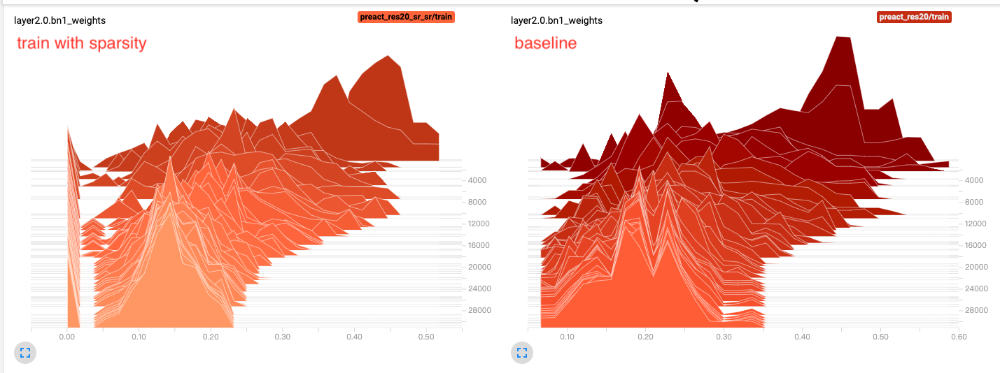

# Network Slimming (Pytorch 1.0)

This repository contains an pytorch implementation for the following paper 
[Learning Efficient Convolutional Networks Through Network Slimming](http://openaccess.thecvf.com/content_iccv_2017/html/Liu_Learning_Efficient_Convolutional_ICCV_2017_paper.html) (ICCV 2017).  


- python 3.5+
- pytorch 1.1.0

## Channel Selection Layer
`ChannelSelection` layer is used to help the pruning of ResNet. This layer stores a parameter indexes which is initialized to an all-1 vector.
During pruning, it will set some places to 0 which correspond to the pruned channels.

## Baseline
Train preactivation resnet20 as baseline.
```bash
python3 main.py --arch=preact_res20 --tag=baseline
```

## Train with Sparsity
Add L1 regularization to BatchNorm2d layer's weight

```bash
python3 main.py -sr --s 0.0001 --arch=preact_res20
```

`--s` will be used in `update_bn` function
```python
def update_bn(model, s=0.0001):
    for m in model.modules():
        if isinstance(m, nn.BatchNorm2d):
            m.weight.grad.data.add_(s * torch.sign(m.weight.data))  # L1
```

Best accuracy model in `./ckpts/preact_res20/best_acc`

You can compare distribution of `BatchNorm2d` weight in tensorboard. 




## Prune model trained with sparsity
Run following command and pruned model will be saved as `./ckpts/pruned/prect/preact_res20_pruned.pth.tar`.

```bash
python3 resprune.py --ckpt_dir=./ckpts/preact_res20_sr/best_acc --arch=preact_res20

Loading checkpoint from ckpts/preact_res20_sr/best_acc/ckpt_24696_acc90.960_loss0.2836.pth.pth.tar
BN layer name: layer1.0.bn1	pruned 43.75%(7/16)
BN layer name: layer1.0.bn2	pruned 18.75%(3/16)
BN layer name: layer1.0.bn3	pruned 0.00%(0/16)
BN layer name: layer1.1.bn1	pruned 89.06%(57/64)
BN layer name: layer1.1.bn2	pruned 37.50%(6/16)
BN layer name: layer1.1.bn3	pruned 0.00%(0/16)
BN layer name: layer2.0.bn1	pruned 43.75%(28/64)
BN layer name: layer2.0.bn2	pruned 0.00%(0/32)
BN layer name: layer2.0.bn3	pruned 0.00%(0/32)
BN layer name: layer2.1.bn1	pruned 87.50%(112/128)
BN layer name: layer2.1.bn2	pruned 0.00%(0/32)
BN layer name: layer2.1.bn3	pruned 0.00%(0/32)
BN layer name: layer3.0.bn1	pruned 19.53%(25/128)
BN layer name: layer3.0.bn2	pruned 0.00%(0/64)
BN layer name: layer3.0.bn3	pruned 0.00%(0/64)
BN layer name: layer3.1.bn1	pruned 51.17%(131/256)
BN layer name: layer3.1.bn2	pruned 0.00%(0/64)
BN layer name: layer3.1.bn3	pruned 0.00%(0/64)
BN layer name: bn	pruned 68.75%(176/256)
cfg 19: [9, 13, 16, 7, 10, 16, 36, 32, 32, 16, 32, 32, 103, 64, 64, 125, 64, 64, 80]
Pruned model save to: ./ckpts/pruned/preact_res20_pruned.pth.tar
Pruned rate: 0.4
Model acc:90.960 loss: 0.284 time: 1.526s
Pruned model acc:17.660 loss: 7.252 time: 1.398s
Time reduce: 8.3854% (1.53s -> 1.40s)
Model params reduce: 8.4535% (220394.00 -> 201763.00)
Model size reduce: 53.4249% (1.72mb->0.80mb)
```


## Fine tune pruned model
```bash
python3 main.py --refine=./ckpts/pruned/preact_res20_pruned.pth.tar --arch=preact_res20 --tag=fine_tune_pruned
```

